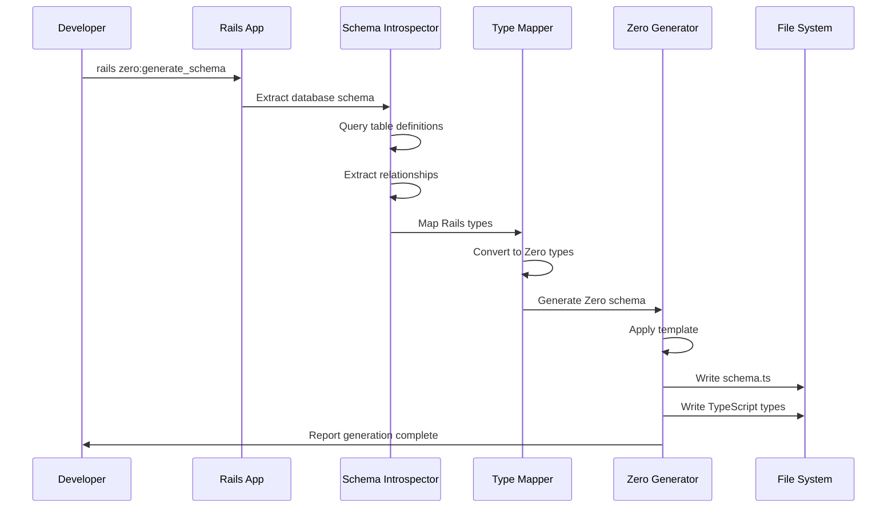
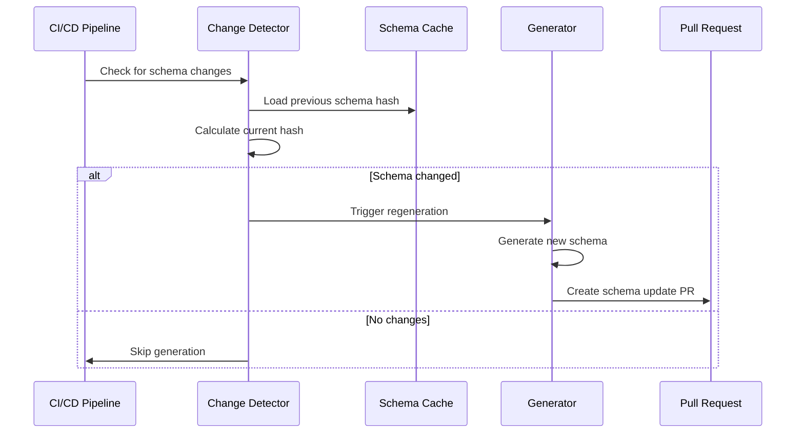

# Data Flow Architecture

## Schema Generation Flow

```mermaid
sequenceDiagram
    participant Dev as Developer
    participant Rails as Rails App
    participant Intro as Schema Introspector
    participant Mapper as Type Mapper
    participant Gen as Zero Generator
    participant FS as File System
    
    Dev->>Rails: rails zero:generate_schema
    Rails->>Intro: Extract database schema
    Intro->>Intro: Query table definitions
    Intro->>Intro: Extract relationships
    Intro->>Mapper: Map Rails types
    Mapper->>Mapper: Convert to Zero types
    Mapper->>Gen: Generate Zero schema
    Gen->>Gen: Apply template
    Gen->>FS: Write schema.ts
    Gen->>FS: Write TypeScript types
    Gen->>Dev: Report generation complete
```

## Change Detection Flow

```mermaid
sequenceDiagram
    participant CI as CI/CD Pipeline
    participant Detector as Change Detector
    participant Cache as Schema Cache
    participant Gen as Generator
    participant PR as Pull Request
    
    CI->>Detector: Check for schema changes
    Detector->>Cache: Load previous schema hash
    Detector->>Detector: Calculate current hash
    alt Schema changed
        Detector->>Gen: Trigger regeneration
        Gen->>Gen: Generate new schema
        Gen->>PR: Create schema update PR
    else No changes
        Detector->>CI: Skip generation
    end
```
