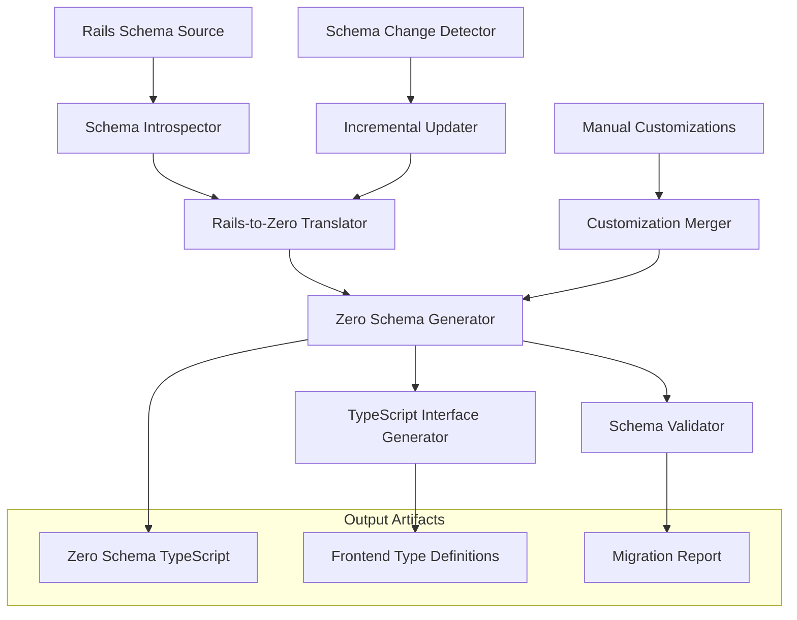

# High-Level Architecture

```mermaid
graph TB
    A[Rails Schema Source] --> B[Schema Introspector]
    B --> C[Rails-to-Zero Translator]
    C --> D[Zero Schema Generator]
    D --> E[TypeScript Interface Generator]
    D --> F[Schema Validator]
    
    G[Manual Customizations] --> H[Customization Merger]
    H --> D
    
    I[Schema Change Detector] --> J[Incremental Updater]
    J --> C
    
    subgraph "Output Artifacts"
        K[Zero Schema TypeScript]
        L[Frontend Type Definitions]
        M[Migration Report]
    end
    
    D --> K
    E --> L
    F --> M
```
