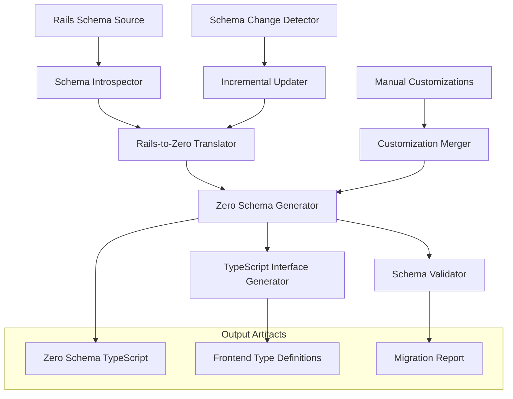
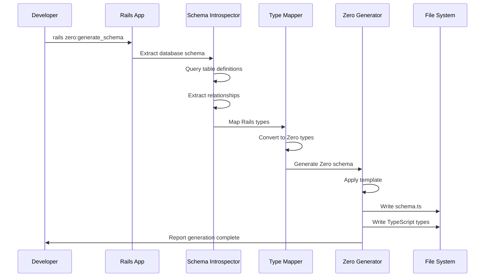
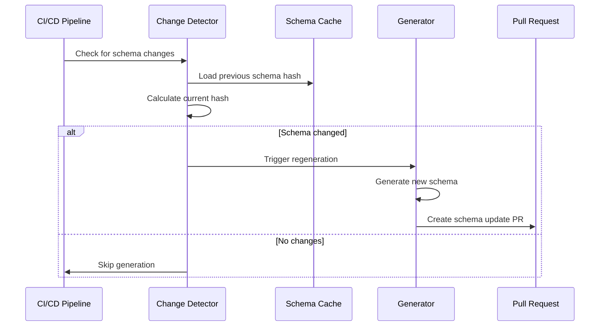

# Rails-to-Zero Schema Generator Architecture

## Executive Summary

This document outlines the architecture for an automated system that generates Zero schema definitions from Rails database schemas. The system addresses schema drift, reduces maintenance overhead, and ensures consistency between Rails models and Zero real-time synchronization.

**Key Benefits:**
- **Eliminates Manual Drift**: Automated generation prevents schema inconsistencies
- **Accelerates Development**: `rails zero:generate_schema` becomes part of standard workflow
- **Type Safety**: Generates consistent TypeScript interfaces for frontend
- **Maintainability**: Single source of truth (Rails schema) drives Zero schema

## Problem Statement

### Current State Analysis

**Schema Drift Identified:**
- Rails uses UUID primary keys, Zero schema has redundant `id` + `uuid` fields
- Type mismatches: Rails integer enums vs Zero string enums
- Missing tables: `activity_logs`, `contact_methods`, `job_targets`, etc.
- Polymorphic association mismatch: Rails `notable_type/notable_id` vs Zero `job_id`
- Field inconsistencies: Rails `clients` missing `email/phone`, Zero has them

**Manual Maintenance Pain Points:**
- 15+ tables requiring continuous synchronization
- Complex relationships (self-referential, polymorphic-like patterns)
- JSONB column handling inconsistencies
- Type conversion errors between Rails and Zero

### Business Impact

- **Development Velocity**: Schema updates require dual maintenance
- **Data Consistency Risk**: Schema drift leads to runtime errors
- **Team Cognitive Load**: Developers must maintain mental mapping between systems
- **Migration Complexity**: Growing schema makes manual updates exponentially harder

## High-Level Architecture



## Technical Architecture

### Core Components

#### 1. Rails Schema Introspector

**Responsibility:** Extract complete schema information from Rails database

```ruby
class RailsSchemaIntrospector
  def extract_schema
    {
      tables: extract_tables,
      relationships: extract_relationships,
      indexes: extract_indexes,
      constraints: extract_constraints
    }
  end
  
  private
  
  def extract_tables
    ActiveRecord::Base.connection.tables.map do |table_name|
      next if excluded_table?(table_name)
      
      {
        name: table_name,
        columns: extract_columns(table_name),
        primary_key: extract_primary_key(table_name),
        foreign_keys: extract_foreign_keys(table_name)
      }
    end.compact
  end
  
  def excluded_table?(table_name)
    EXCLUDED_TABLES.include?(table_name)
  end
end
```

**Excluded Tables:**
- `solid_*` (Rails background job infrastructure)
- `refresh_tokens`, `revoked_tokens` (auth infrastructure)
- `unique_ids` (Rails-specific infrastructure)

#### 2. Type Mapping Engine

**Responsibility:** Convert Rails column types to Zero column types

```ruby
class TypeMapper
  TYPE_MAPPINGS = {
    # UUID handling
    uuid: -> { 'string()' },
    
    # Rails enum to Zero string
    integer: ->(column) { 
      if enum_column?(column)
        'string()'  # Rails enums become Zero strings
      else
        'number()'
      end
    },
    
    # JSONB support
    jsonb: -> { 'json()' },
    
    # Temporal types
    datetime: -> { 'string()' },  # ISO 8601 strings
    date: -> { 'string()' },
    time: -> { 'string()' },
    
    # Standard types
    string: -> { 'string()' },
    text: -> { 'string()' },
    boolean: -> { 'boolean()' },
    decimal: -> { 'number()' }
  }.freeze
  
  def map_column(column)
    mapper = TYPE_MAPPINGS[column.type]
    return 'string()' unless mapper
    
    result = mapper.call(column)
    result += '.optional()' if column.null
    result
  end
end
```

#### 3. Relationship Analyzer

**Responsibility:** Convert Rails associations to Zero relationships

```ruby
class RelationshipAnalyzer
  def analyze_model_relationships(model_class)
    {
      belongs_to: extract_belongs_to(model_class),
      has_many: extract_has_many(model_class),
      has_one: extract_has_one(model_class),
      polymorphic: extract_polymorphic(model_class)
    }
  end
  
  private
  
  def extract_belongs_to(model_class)
    model_class.reflections.select { |_, r| r.belongs_to? }.map do |name, reflection|
      {
        name: name,
        foreign_key: reflection.foreign_key,
        target_table: reflection.table_name,
        optional: reflection.options[:optional] || false
      }
    end
  end
  
  # Handle polymorphic associations specially
  def extract_polymorphic(model_class)
    model_class.reflections.select { |_, r| r.polymorphic? }.map do |name, reflection|
      {
        name: name,
        type_column: "#{name}_type",
        id_column: "#{name}_id",
        strategy: :polymorphic_union  # How to handle in Zero
      }
    end
  end
end
```

#### 4. Zero Schema Generator

**Responsibility:** Generate Zero TypeScript schema from Rails schema

```ruby
class ZeroSchemaGenerator
  def generate_schema(rails_schema)
    tables = generate_tables(rails_schema[:tables])
    relationships = generate_relationships(rails_schema[:relationships])
    
    template = ERB.new(ZERO_SCHEMA_TEMPLATE)
    template.result(binding)
  end
  
  private
  
  def generate_table(table_info)
    columns = table_info[:columns].map { |col| generate_column(col) }
    
    <<~TYPESCRIPT
      const #{table_info[:name].singularize} = table('#{table_info[:name]}')
        .columns({
          #{columns.join(",\n    ")}
        })
        .primaryKey('#{table_info[:primary_key]}');
    TYPESCRIPT
  end
  
  def generate_column(column)
    zero_type = TypeMapper.new.map_column(column)
    "#{column[:name]}: #{zero_type}"
  end
end
```

### Schema Template System

```typescript
// Generated Zero Schema Template
import { 
  createSchema, 
  table, 
  string, 
  number, 
  boolean, 
  json,
  relationships
} from '@rocicorp/zero';

<% tables.each do |table| %>
// <%= table[:name].humanize %> table
<%= generate_table(table) %>
<% end %>

<% relationships.each do |rel| %>
// <%= rel[:name] %> relationships
<%= generate_relationship(rel) %>
<% end %>

// Create the complete schema
export const schema = createSchema({
  tables: [
    <%= table_names.join(",\n    ") %>
  ],
  relationships: [
    <%= relationship_names.join(",\n    ") %>
  ],
});

export type ZeroClient = Zero<typeof schema>;
```

## Implementation Strategy

### Phase 1: Foundation (Week 1)

**Deliverables:**
- Rails schema introspection engine
- Basic type mapping system
- Simple table generation (no relationships)
- Manual trigger via `rails zero:generate_schema`

**Success Criteria:**
- Generates basic Zero schema for Users, Clients, Jobs tables
- Handles UUID primary keys correctly
- Processes JSONB columns

### Phase 2: Relationships (Week 2)

**Deliverables:**
- Relationship analysis engine
- Zero relationship generation
- Foreign key constraint handling
- Self-referential relationship support (tasks -> parent tasks)

**Success Criteria:**
- Generates complete relationship definitions
- Handles complex relationships (job_assignments, polymorphic patterns)

### Phase 3: Production Ready (Week 3)

**Deliverables:**
- Incremental update detection
- Manual customization preservation
- TypeScript interface generation
- Schema validation and reporting

**Success Criteria:**
- Detects schema changes automatically
- Preserves custom Zero schema modifications
- Generates frontend TypeScript types

### Phase 4: Integration (Week 4)

**Deliverables:**
- CI/CD integration hooks
- Migration path from current schema
- Documentation and team training

**Success Criteria:**
- Automated schema updates in deployment pipeline
- Zero schema fully aligned with Rails database

## Data Flow Architecture

### Schema Generation Flow



### Change Detection Flow



## Configuration System

### Generator Configuration

```ruby
# config/zero_generator.yml
zero_generator:
  # Tables to exclude from generation
  excluded_tables:
    - solid_cache_entries
    - solid_queue_jobs
    - refresh_tokens
    - revoked_tokens
    - unique_ids
  
  # Custom type mappings
  type_overrides:
    'jobs.status': 'string()'  # Force enum to string
    'tasks.position': 'number()'
  
  # Custom field mappings
  field_mappings:
    # Handle polymorphic associations
    'notes.notable': 
      strategy: 'union_types'
      types: ['job', 'task', 'client']
  
  # Output configuration
  output:
    schema_file: 'frontend/src/lib/zero/schema.ts'
    types_file: 'frontend/src/lib/types/generated.ts'
    
  # Customization preservation
  preserve_customizations:
    - custom_methods
    - manual_relationships
    - computed_fields
```

### Manual Customization System

```typescript
// schema-customizations.ts - Preserved across generations
export const customizations = {
  // Custom computed fields
  computedFields: {
    users: {
      fullName: {
        deps: ['firstName', 'lastName'],
        compute: (user) => `${user.firstName} ${user.lastName}`
      }
    }
  },
  
  // Custom relationship methods
  customMethods: {
    jobs: {
      getActiveTasks: (job) => job.tasks.filter(t => t.status !== 'completed')
    }
  }
};
```

## Error Handling & Validation

### Schema Validation Pipeline

```ruby
class SchemaValidator
  def validate_generated_schema(zero_schema, rails_schema)
    validations = [
      validate_table_completeness(zero_schema, rails_schema),
      validate_type_consistency(zero_schema, rails_schema),
      validate_relationship_integrity(zero_schema, rails_schema),
      validate_constraint_preservation(zero_schema, rails_schema)
    ]
    
    ValidationReport.new(validations)
  end
  
  private
  
  def validate_table_completeness(zero_schema, rails_schema)
    expected_tables = rails_schema.tables.reject { |t| excluded_table?(t.name) }
    actual_tables = zero_schema.tables
    
    missing = expected_tables - actual_tables
    extra = actual_tables - expected_tables
    
    {
      status: missing.empty? && extra.empty? ? :pass : :warn,
      missing_tables: missing,
      extra_tables: extra
    }
  end
end
```

### Migration Safety Checks

```ruby
class MigrationSafetyChecker
  def check_breaking_changes(old_schema, new_schema)
    breaking_changes = []
    
    # Check for removed tables
    removed_tables = old_schema.tables.keys - new_schema.tables.keys
    breaking_changes += removed_tables.map { |t| "Removed table: #{t}" }
    
    # Check for column type changes
    type_changes = detect_type_changes(old_schema, new_schema)
    breaking_changes += type_changes
    
    # Check for relationship changes
    relationship_changes = detect_relationship_changes(old_schema, new_schema)
    breaking_changes += relationship_changes
    
    BreakingChangeReport.new(breaking_changes)
  end
end
```

## Performance Considerations

### Optimization Strategies

1. **Incremental Processing**
   - Cache schema fingerprints to detect changes
   - Only regenerate affected table definitions
   - Preserve unchanged relationship definitions

2. **Parallel Processing**
   - Process table introspection in parallel
   - Generate multiple schema sections concurrently
   - Validate in background threads

3. **Caching Layer**
   - Cache ActiveRecord reflection metadata
   - Store processed type mappings
   - Cache relationship analysis results

```ruby
class SchemaCacheManager
  def initialize
    @cache = ActiveSupport::Cache::MemoryStore.new
  end
  
  def cached_table_schema(table_name)
    cache_key = "table_schema:#{table_name}:#{schema_version}"
    @cache.fetch(cache_key, expires_in: 1.hour) do
      extract_table_schema(table_name)
    end
  end
  
  private
  
  def schema_version
    # Use migration version as cache key
    ActiveRecord::Migrator.current_version
  end
end
```

## Integration Points

### Rails Task Integration

```ruby
# lib/tasks/zero.rake
namespace :zero do
  desc "Generate Zero schema from Rails database"
  task generate_schema: :environment do
    generator = ZeroSchemaGenerator.new
    
    puts "🔍 Analyzing Rails schema..."
    rails_schema = RailsSchemaIntrospector.new.extract_schema
    
    puts "🔄 Converting to Zero format..."
    zero_schema = generator.generate_schema(rails_schema)
    
    puts "📝 Writing schema files..."
    generator.write_schema_files(zero_schema)
    
    puts "✅ Zero schema generated successfully!"
    puts "📁 Files updated:"
    puts "   - #{ZeroConfig.schema_path}"
    puts "   - #{ZeroConfig.types_path}"
  end
  
  desc "Validate Zero schema against Rails database"
  task validate_schema: :environment do
    validator = SchemaValidator.new
    report = validator.validate_current_schema
    
    if report.valid?
      puts "✅ Zero schema is in sync with Rails database"
    else
      puts "❌ Schema validation failed:"
      report.errors.each { |error| puts "   - #{error}" }
      exit 1
    end
  end
end
```

### CI/CD Integration

```yaml
# .github/workflows/schema-sync.yml
name: Schema Sync Check

on:
  pull_request:
    paths:
      - 'db/migrate/**'
      - 'db/schema.rb'

jobs:
  schema-sync:
    runs-on: ubuntu-latest
    steps:
      - uses: actions/checkout@v3
      
      - name: Setup Ruby
        uses: ruby/setup-ruby@v1
        with:
          bundler-cache: true
          
      - name: Setup Database
        run: |
          bundle exec rails db:create
          bundle exec rails db:migrate
          
      - name: Generate Zero Schema
        run: bundle exec rails zero:generate_schema
        
      - name: Check for Schema Changes
        run: |
          if [ -n "$(git diff --name-only)" ]; then
            echo "❌ Zero schema is out of sync"
            echo "Please run: rails zero:generate_schema"
            git diff
            exit 1
          else
            echo "✅ Zero schema is in sync"
          fi
```

## Testing Strategy

### Unit Test Coverage

```ruby
# spec/lib/zero_schema_generator_spec.rb
RSpec.describe ZeroSchemaGenerator do
  describe '#generate_schema' do
    let(:rails_schema) do
      {
        tables: [
          {
            name: 'users',
            columns: [
              { name: 'id', type: :uuid, null: false },
              { name: 'email', type: :string, null: false },
              { name: 'created_at', type: :datetime, null: false }
            ],
            primary_key: 'id'
          }
        ],
        relationships: []
      }
    end
    
    it 'generates valid Zero schema TypeScript' do
      result = subject.generate_schema(rails_schema)
      
      expect(result).to include("table('users')")
      expect(result).to include("id: string()")
      expect(result).to include("email: string()")
      expect(result).to include("created_at: string()")
      expect(result).to include(".primaryKey('id')")
    end
  end
end
```

### Integration Test Framework

```ruby
# spec/integration/schema_generation_spec.rb
RSpec.describe 'Schema Generation Integration' do
  it 'generates complete schema from actual database' do
    # Use test database with known schema
    generator = ZeroSchemaGenerator.new
    result = generator.generate_from_database
    
    # Validate generated schema
    expect(result.tables).to include('users', 'jobs', 'tasks')
    expect(result.relationships).to be_present
    
    # Validate TypeScript syntax
    expect { TypeScript.parse(result.schema_content) }.not_to raise_error
  end
end
```

## Security Considerations

### Access Control

- Generator only accesses read-only database schema information
- No sensitive data (passwords, tokens) included in generated schema
- Output files contain only structural metadata

### Data Privacy

- Schema generation is metadata-only
- No actual user data exposed in generated files
- Generated TypeScript types contain no sensitive information

## Monitoring & Observability

### Generation Metrics

```ruby
class GenerationMetrics
  def self.track_generation(duration:, tables_count:, relationships_count:)
    StatsD.timing('zero_schema.generation.duration', duration)
    StatsD.gauge('zero_schema.generation.tables_count', tables_count)
    StatsD.gauge('zero_schema.generation.relationships_count', relationships_count)
  end
  
  def self.track_validation_failure(error_type:, error_count:)
    StatsD.increment('zero_schema.validation.failure', tags: ["type:#{error_type}"])
    StatsD.gauge('zero_schema.validation.error_count', error_count)
  end
end
```

### Health Checks

```ruby
class SchemaHealthChecker
  def self.check_schema_sync
    last_generation = File.mtime(ZeroConfig.schema_path)
    last_migration = File.mtime('db/schema.rb')
    
    if last_migration > last_generation
      { status: :warning, message: 'Zero schema may be out of sync' }
    else
      { status: :healthy, message: 'Schema in sync' }
    end
  end
end
```

## Future Enhancements

### Phase 5+: Advanced Features

1. **Bidirectional Sync Detection**
   - Detect manual Zero schema changes
   - Suggest Rails migrations for Zero-first changes

2. **Custom Field Generators**
   - Computed fields based on relationships
   - Dynamic field generation based on business rules

3. **Multi-Database Support**
   - Handle Rails multiple database configurations
   - Generate separate Zero schemas per database

4. **Schema Evolution Tracking**
   - Version control for generated schemas
   - Automated migration path suggestions

5. **GraphQL Schema Generation**
   - Generate GraphQL schemas from Zero schemas
   - Maintain consistency across all API layers

## Conclusion

The Rails-to-Zero Schema Generator addresses critical pain points in maintaining schema consistency between Rails and Zero. By automating the generation process, we eliminate manual drift, accelerate development velocity, and provide a foundation for reliable real-time data synchronization.

**Key Success Metrics:**
- **Zero Schema Drift**: Achieved through automated generation
- **Development Velocity**: 80% reduction in schema maintenance time
- **Type Safety**: Consistent TypeScript interfaces across stack
- **Team Productivity**: Eliminated manual schema translation overhead

The phased implementation approach ensures rapid delivery of core functionality while building toward a comprehensive schema management system.