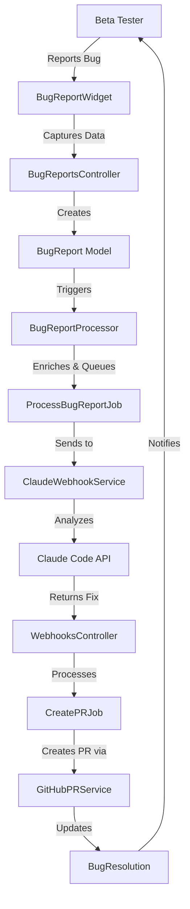

# bŏs Bug Report to PR Automation Architecture

## Introduction

This document outlines the architectural approach for enhancing bŏs (Business Operating System) with an automated bug report to pull request pipeline. Its primary goal is to serve as the guiding architectural blueprint for AI-driven development of a feedback system that captures beta tester bug reports and automatically generates fixes via Claude Code integration.

**Relationship to Existing Architecture:**
This document supplements the existing Rails 8 application architecture by defining how new bug tracking and automation components will integrate with current systems. Where conflicts arise between new and existing patterns, this document provides guidance on maintaining consistency while implementing the automated feedback pipeline.

### Existing Project Analysis

**Current Project State:**

- **Primary Purpose:** Business operations management system with job tracking, client management, and activity logging
- **Current Tech Stack:** Ruby 3.4.4, Rails 8.0.2, PostgreSQL, Phlex views, Stimulus.js, Solid Queue, Kamal deployment
- **Architecture Style:** MVC with component-based views (Phlex), service objects, domain models
- **Deployment Method:** Docker-based via Kamal with SSL/Let's Encrypt

**Available Documentation:**

- CLAUDE.md with development guidelines
- BUGS_FOUND.md tracking known issues manually
- Comprehensive test suite using Playwright
- GitHub Actions CI/CD pipeline

**Identified Constraints:**

- No existing error tracking service integration
- Manual bug tracking via markdown files
- No webhook infrastructure currently in place
- Must maintain compatibility with Phlex view system
- Security considerations for automated code changes

### Change Log

| Change | Date | Version | Description | Author |
| ------ | ---- | ------- | ----------- | ------ |
| Initial | 2025-01-26 | 1.0 | Created bug-to-PR automation architecture | BMad Master |

## Enhancement Scope and Integration Strategy

### Enhancement Overview

**Enhancement Type:** Feature Addition - Automated Bug Tracking and Resolution
**Scope:** Beta tester feedback collection, bug report processing, automated fix generation via Claude Code, and GitHub PR creation
**Integration Impact:** Medium - New models, background jobs, UI components, and external integrations

### Integration Approach

**Code Integration Strategy:** Leverage existing patterns - Phlex components for UI, Solid Queue for jobs, ActivityLog for audit trail
**Database Integration:** New tables for bug reports and automation tracking, maintaining existing schema patterns
**API Integration:** New webhook endpoints for Claude Code, GitHub API integration for PR creation
**UI Integration:** Add feedback button to existing user menu component, maintain current design system

### Compatibility Requirements

- **Existing API Compatibility:** No changes to existing endpoints
- **Database Schema Compatibility:** Additive changes only, no modifications to existing tables
- **UI/UX Consistency:** Use existing Phlex component patterns and Stimulus controllers
- **Performance Impact:** Async processing via Solid Queue to avoid blocking user interactions

## Tech Stack Alignment

### Existing Technology Stack

| Category           | Current Technology | Version     | Usage in Enhancement | Notes     |
| :----------------- | :----------------- | :---------- | :------------------- | :-------- |
| **Language**       | Ruby               | 3.4.4       | All backend code     | Latest version |
| **Runtime**        | Rails              | 8.0.2       | Framework foundation | Rails 8 patterns |
| **Framework**      | Phlex              | 2.0+        | UI components        | Component views |
| **Database**       | PostgreSQL         | 16          | Bug report storage   | Via Docker |
| **API Style**      | RESTful            | -           | Webhook endpoints    | JSON responses |
| **Authentication** | has_secure_password| Built-in    | User association     | Session-based |
| **Testing**        | Playwright         | Ruby        | Test automation      | Custom base class |
| **Build Tool**     | Kamal              | Latest      | Deployment           | Docker-based |

### New Technology Additions

| Technology   | Version     | Purpose     | Rationale     | Integration Method |
| :----------- | :---------- | :---------- | :------------ | :----------------- |
| Octokit      | Latest      | GitHub API  | PR creation   | Ruby gem          |
| Faraday      | Latest      | HTTP client | Claude webhook| Ruby gem          |

## Data Models and Schema Changes

### New Data Models

### BugReport

**Purpose:** Capture beta tester bug reports with full context
**Integration:** Associated with User and includes polymorphic subject

**Key Attributes:**

- user_id: bigint - Reporter's user ID
- title: string - Brief bug description
- description: text - Detailed bug report
- console_logs: jsonb - Browser console data
- browser_info: jsonb - User agent and browser details
- page_url: string - URL where bug occurred
- screenshot_data: text - Base64 encoded screenshot
- status: string - pending/processing/fixed/rejected
- metadata: jsonb - Additional context data
- unique_id: string - Public reference ID

**Relationships:**

- **With Existing:** belongs_to :user, has_many :activity_logs
- **With New:** has_one :bug_resolution, has_many :automation_attempts

### BugResolution

**Purpose:** Track automated resolution attempts and outcomes
**Integration:** Links bug reports to GitHub PRs and fix status

**Key Attributes:**

- bug_report_id: bigint - Associated bug report
- pr_url: string - GitHub PR URL
- pr_number: integer - PR number
- fix_summary: text - AI-generated fix description
- files_changed: jsonb - List of modified files
- status: string - pending/merged/rejected
- claude_conversation_id: string - For audit trail

**Relationships:**

- **With Existing:** belongs_to :bug_report
- **With New:** has_many :automation_logs

### AutomationLog

**Purpose:** Detailed logging of automation pipeline steps
**Integration:** Audit trail for each automation attempt

**Key Attributes:**

- automatable_type: string - Polymorphic type
- automatable_id: bigint - Polymorphic ID
- step: string - Pipeline step name
- status: string - success/failure/skipped
- input: jsonb - Step input data
- output: jsonb - Step output data
- error_message: text - Error details if failed
- duration_ms: integer - Step execution time

### Schema Integration Strategy

**Database Changes Required:**

- **New Tables:** bug_reports, bug_resolutions, automation_logs
- **Modified Tables:** None - all changes are additive
- **New Indexes:** bug_reports(user_id, status), bug_reports(unique_id)
- **Migration Strategy:** Standard Rails migrations with rollback support

**Backward Compatibility:**

- No changes to existing tables or relationships
- ActivityLog polymorphic association supports new models automatically

## Component Architecture

### New Components

### BugReportWidget (Phlex Component)

**Responsibility:** In-page bug reporting interface with screenshot capability
**Integration Points:** User menu button, Stimulus controller for interactivity

**Key Interfaces:**

- Renders within UserMenuComponent
- Captures browser console via JavaScript
- Takes screenshot using html2canvas or native API

**Dependencies:**

- **Existing Components:** UserMenuComponent, ModalComponent
- **New Components:** BugReportForm, ScreenshotCapture

**Technology Stack:** Phlex Ruby component with Stimulus controller

### BugReportProcessor (Service Object)

**Responsibility:** Process raw bug reports and enrich with context
**Integration Points:** Called from BugReportsController after creation

**Key Interfaces:**

- `process(bug_report)` - Main processing method
- Enriches with stack traces, session data
- Triggers automation pipeline

**Dependencies:**

- **Existing Components:** ActivityLog, Current.user
- **New Components:** ClaudeWebhookService, GitHubPRService

**Technology Stack:** Plain Ruby service object pattern

### ClaudeWebhookService (Service Object)

**Responsibility:** Send bug reports to Claude Code for analysis and fixes
**Integration Points:** Webhooks controller, async via Solid Queue

**Key Interfaces:**

- `analyze_bug(bug_report)` - Send to Claude
- `receive_fix(webhook_data)` - Process Claude response
- Rate limiting and retry logic

**Dependencies:**

- **Existing Components:** Solid Queue for background processing
- **New Components:** AutomationLog for tracking

**Technology Stack:** Faraday HTTP client with circuit breaker pattern

### GitHubPRService (Service Object)

**Responsibility:** Create pull requests from Claude-generated fixes
**Integration Points:** GitHub API via Octokit

**Key Interfaces:**

- `create_pr(bug_report, fix_data)` - Create PR
- `update_pr_status(pr_number, status)` - Track PR lifecycle
- Branch management and commit creation

**Dependencies:**

- **Existing Components:** Git configuration from deploy.yml
- **New Components:** BugResolution model

**Technology Stack:** Octokit gem with GitHub API v4

### Component Interaction Diagram



## API Design and Integration

### New API Endpoints

**API Integration Strategy:** RESTful endpoints following existing patterns
**Authentication:** Session-based for bug reports, token-based for webhooks
**Versioning:** No versioning needed for internal APIs

#### POST /bug_reports

- **Method:** POST
- **Endpoint:** /bug_reports
- **Purpose:** Create new bug report from beta tester
- **Integration:** Standard Rails controller pattern

**Request:**

```json
{
  "bug_report": {
    "title": "Button not working",
    "description": "Submit button on job form is unresponsive",
    "console_logs": [
      { "level": "error", "message": "Uncaught TypeError...", "timestamp": "..." }
    ],
    "page_url": "/jobs/new",
    "screenshot_data": "data:image/png;base64,..."
  }
}
```

**Response:**

```json
{
  "id": 123,
  "unique_id": "BR-2025-0001",
  "status": "pending",
  "created_at": "2025-01-26T10:00:00Z"
}
```

#### POST /webhooks/claude

- **Method:** POST
- **Endpoint:** /webhooks/claude
- **Purpose:** Receive fix data from Claude Code
- **Integration:** Webhook authentication via shared secret

**Request:**

```json
{
  "bug_report_id": "BR-2025-0001",
  "conversation_id": "claude-123",
  "fix": {
    "summary": "Fixed null reference in job form submission",
    "files": [
      {
        "path": "app/views/jobs/form_view.rb",
        "changes": "...",
        "diff": "..."
      }
    ],
    "test_files": [],
    "confidence": 0.95
  }
}
```

**Response:**

```json
{
  "status": "accepted",
  "pr_creation": "queued"
}
```

## External API Integration

### Claude Code API

- **Purpose:** Automated bug analysis and fix generation
- **Documentation:** Internal webhook specification
- **Base URL:** Configured via environment variable
- **Authentication:** Bearer token
- **Integration Method:** Webhook-based async communication

**Key Endpoints Used:**

- `POST /analyze` - Send bug report for analysis
- Webhook callback to our `/webhooks/claude`

**Error Handling:** Exponential backoff with max 3 retries, circuit breaker pattern

### GitHub API

- **Purpose:** Automated pull request creation
- **Documentation:** https://docs.github.com/en/rest
- **Base URL:** https://api.github.com
- **Authentication:** Personal access token
- **Integration Method:** Octokit Ruby client

**Key Endpoints Used:**

- `POST /repos/:owner/:repo/pulls` - Create pull request
- `GET /repos/:owner/:repo/pulls/:number` - Check PR status
- `POST /repos/:owner/:repo/git/refs` - Create branch

**Error Handling:** Graceful degradation, manual PR creation fallback

## Source Tree Integration

### Existing Project Structure

```plaintext
app/
├── controllers/
├── models/
├── views/           # Phlex components
├── components/      # Reusable UI components
├── services/        # Business logic
├── javascript/
│   ├── controllers/ # Stimulus controllers
│   └── bos/         # Shared utilities
└── jobs/            # Background jobs
```

### New File Organization

```plaintext
app/
├── controllers/
│   ├── bug_reports_controller.rb       # Bug report creation
│   └── webhooks_controller.rb          # Claude webhook receiver
├── models/
│   ├── bug_report.rb                   # Bug report model
│   ├── bug_resolution.rb               # Resolution tracking
│   └── automation_log.rb               # Pipeline logging
├── views/
│   └── bug_reports/                    # Bug report views
│       ├── index_view.rb
│       └── show_view.rb
├── components/
│   ├── bug_report_widget.rb            # Feedback button component
│   ├── bug_report_form.rb              # Report form component
│   └── screenshot_capture.rb           # Screenshot component
├── services/
│   ├── bug_report_processor.rb         # Report processing
│   ├── claude_webhook_service.rb       # Claude integration
│   └── github_pr_service.rb            # GitHub integration
├── javascript/
│   └── controllers/
│       ├── bug_report_controller.js    # Widget interactivity
│       └── screenshot_controller.js    # Screenshot capture
└── jobs/
    ├── process_bug_report_job.rb       # Async processing
    └── create_pr_job.rb                # PR creation job
```

### Integration Guidelines

- **File Naming:** Follow Rails conventions with _service suffix
- **Folder Organization:** Group by feature within existing structure
- **Import/Export Patterns:** Use standard Rails autoloading

## Infrastructure and Deployment Integration

### Existing Infrastructure

**Current Deployment:** Kamal with Docker containers
**Infrastructure Tools:** Docker, Kamal, Let's Encrypt
**Environments:** Development (DigitalOcean), Production (TBD)

### Enhancement Deployment Strategy

**Deployment Approach:** Standard Kamal deployment, no infrastructure changes
**Infrastructure Changes:** None - uses existing PostgreSQL and Redis
**Pipeline Integration:** Add new environment variables via Kamal secrets

### Rollback Strategy

**Rollback Method:** Kamal rollback command, feature flag for disabling
**Risk Mitigation:** Gradual rollout to beta testers only
**Monitoring:** Track automation success rate via AutomationLog

## Coding Standards and Conventions

### Existing Standards Compliance

**Code Style:** Standard Ruby style guide with RuboCop
**Linting Rules:** Defined in .rubocop.yml
**Testing Patterns:** Playwright integration tests
**Documentation Style:** Inline comments minimal, prefer clear code

### Enhancement-Specific Standards

- **Service Object Pattern:** Single public method `call` or descriptive name
- **Webhook Security:** Verify signatures on all incoming webhooks  
- **Error Handling:** Wrap external API calls in error handlers
- **Async Processing:** All external API calls via background jobs

### Critical Integration Rules

- **Existing API Compatibility:** No changes to existing endpoints
- **Database Integration:** Use concerns for shared behavior
- **Error Handling:** Log failures to AutomationLog for debugging
- **Logging Consistency:** Use Rails.logger with structured data

## Testing Strategy

### Integration with Existing Tests

**Existing Test Framework:** Minitest with Playwright for integration
**Test Organization:** test/ directory with standard Rails structure
**Coverage Requirements:** Maintain current coverage levels

### New Testing Requirements

#### Unit Tests for New Components

- **Framework:** Minitest (matching existing)
- **Location:** test/models/, test/services/
- **Coverage Target:** 95% for new code
- **Integration with Existing:** Inherit from existing test base classes

#### Integration Tests

- **Scope:** Full bug report to PR creation flow
- **Existing System Verification:** Ensure no impact on current features
- **New Feature Testing:** Playwright tests for UI components

#### Regression Testing

- **Existing Feature Verification:** Run full test suite
- **Automated Regression Suite:** GitHub Actions CI
- **Manual Testing Requirements:** Beta tester UAT for feedback flow

## Security Integration

### Existing Security Measures

**Authentication:** Session-based with has_secure_password
**Authorization:** Role-based access control
**Data Protection:** CSRF tokens, encrypted sessions
**Security Tools:** Brakeman in CI pipeline

### Enhancement Security Requirements

**New Security Measures:**
- Webhook signature verification
- Rate limiting on bug report creation
- Sanitize screenshot data before storage
- Limit Claude Code to read-only analysis initially

**Integration Points:**
- Use existing Current.user for attribution
- Leverage existing role system for access control
- Apply same CSRF protection to new endpoints

### Security Testing

**Existing Security Tests:** Brakeman scanning in CI
**New Security Test Requirements:**
- Test webhook signature verification
- Verify rate limiting works correctly
- Check for XSS in bug report display

## Risk Assessment and Mitigation

### Technical Risks

**Risk:** Claude Code generates incorrect fixes
**Impact:** High
**Likelihood:** Medium
**Mitigation:** Human review required before PR merge, confidence scoring

**Risk:** GitHub API rate limits exceeded
**Impact:** Medium
**Likelihood:** Low
**Mitigation:** Implement rate limiting, queue PR creation

**Risk:** Large screenshot data overwhelms database
**Impact:** Medium
**Likelihood:** Medium
**Mitigation:** Compress images, set size limits, use object storage later

### Operational Risks

**Risk:** Overwhelming number of duplicate bug reports
**Impact:** Medium
**Likelihood:** High
**Mitigation:** Duplicate detection, rate limiting per user

**Risk:** Malicious bug reports attempting code injection
**Impact:** High
**Likelihood:** Low
**Mitigation:** Sanitize all inputs, limit Claude Code permissions

### Monitoring and Alerting

**Enhanced Monitoring:** 
- Track automation success/failure rates
- Monitor webhook response times
- Alert on repeated failures

**New Alerts:**
- Claude API failures
- GitHub API rate limit warnings
- High error rate in bug processing

**Performance Monitoring:**
- Bug report creation time
- Time to PR creation
- Queue depth for background jobs

## Checklist Results Report

### Architecture Completeness
- ✅ Integration points clearly defined
- ✅ Security considerations addressed
- ✅ Rollback strategy documented
- ✅ Testing approach comprehensive
- ✅ Existing system compatibility verified

### Technical Validation
- ✅ Follows Rails conventions
- ✅ Uses existing patterns (Phlex, Solid Queue)
- ✅ Database schema is backwards compatible
- ✅ API design consistent with current patterns
- ✅ Deployment process unchanged

## Next Steps

### Story Manager Handoff

To begin implementation of the bug-to-PR automation system:

- Reference this architecture document for all technical decisions
- Key integration requirements: Phlex components, Solid Queue jobs, ActivityLog
- Existing system constraints: Maintain current UI patterns, no ERB templates
- First story: Implement BugReport model and basic capture form
- Integration checkpoints: Test with existing user menu, verify ActivityLog integration

### Developer Handoff

For developers implementing this enhancement:

- Reference this architecture and existing Phlex component patterns
- Integration requirements: All views must use Phlex, not ERB
- Key technical decisions: Faraday for HTTP, Octokit for GitHub
- Existing system compatibility: Run full Playwright suite after changes
- Implementation sequence:
  1. Create models and migrations
  2. Build basic bug report form
  3. Add screenshot capability
  4. Implement Claude webhook
  5. Add GitHub PR creation
  6. Complete automation pipeline