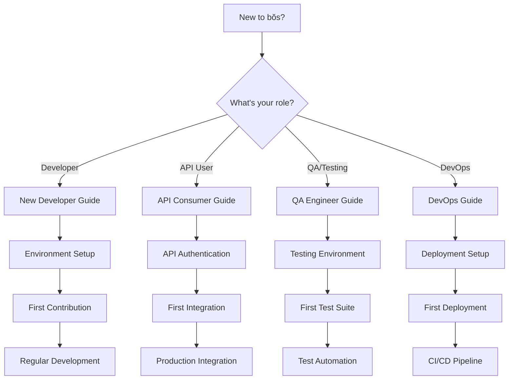

# Getting Started - User Type Navigation

> **Choose your path based on your role and objectives**

## 🎯 Quick User Type Selection

### New to the Project?
- **[New Developer](./new-developer.md)** - First-time contributors and team members
- **[Environment Setup](./environment-setup.md)** - Development environment configuration

### Building with our APIs?
- **[API Consumer](./api-consumer.md)** - Integrating with bŏs APIs
- **[Frontend Integration](./frontend-integration.md)** - Building frontend applications

### Working on specific areas?
- **[Frontend Developer](./frontend-developer.md)** - Svelte + TypeScript development
- **[Backend Developer](./backend-developer.md)** - Rails API development
- **[QA Engineer](./qa-engineer.md)** - Testing and quality assurance
- **[DevOps Engineer](./devops-engineer.md)** - Deployment and infrastructure

---

## 🛤️ User Journey Paths

### [📚 Onboarding Journey](./journeys/onboarding.md)
Complete journey from first contact to productive contribution
- Project overview and context
- Environment setup and verification
- First feature implementation
- Testing and deployment

### [⚡ Development Workflow Journey](./journeys/development-workflow.md)
Daily development workflow and best practices
- Feature development lifecycle
- Code review and collaboration
- Testing and quality assurance
- Deployment and monitoring

### [🧪 Testing Workflow Journey](./journeys/testing-workflow.md)
Comprehensive testing approach and tooling
- Test-driven development
- Playwright testing strategies
- Integration testing patterns
- Performance testing

### [🏗️ Architecture Understanding Journey](./journeys/architecture.md)
Deep dive into system architecture and design
- Frontend architecture patterns
- Backend API design
- Database schema and relationships
- Performance and scalability

---

## 📋 Quick Reference Cards

### [🎨 Frontend Quick Reference](./quick-reference/frontend.md)
Essential frontend development reference
- Svelte component patterns
- TypeScript usage
- Tailwind CSS utilities
- Testing approaches

### [🔧 Backend Quick Reference](./quick-reference/backend.md)
Essential backend development reference
- Rails API patterns
- Database operations
- Authentication/authorization
- Error handling

### [📡 API Quick Reference](./quick-reference/api.md)
API integration and usage reference
- Authentication methods
- Endpoint overview
- Request/response formats
- Error codes and handling

### [🧪 Testing Quick Reference](./quick-reference/testing.md)
Testing tools and patterns reference
- Playwright test patterns
- Test data management
- Mocking strategies
- Performance testing

---

## 🏢 Role-Based Landing Pages

### Development Team
- **[Team Lead](./roles/team-lead.md)** - Project oversight and coordination
- **[Senior Developer](./roles/senior-developer.md)** - Architecture and mentoring
- **[Junior Developer](./roles/junior-developer.md)** - Learning and contributing

### Engineering Roles
- **[Full Stack Developer](./roles/full-stack-developer.md)** - Frontend + Backend development
- **[Frontend Specialist](./roles/frontend-specialist.md)** - UI/UX and frontend systems
- **[Backend Specialist](./roles/backend-specialist.md)** - API and server development
- **[DevOps Specialist](./roles/devops-specialist.md)** - Infrastructure and deployment

### Quality & Operations
- **[QA Engineer](./roles/qa-engineer.md)** - Testing and quality assurance
- **[Site Reliability Engineer](./roles/sre.md)** - System reliability and monitoring
- **[Security Engineer](./roles/security-engineer.md)** - Security and compliance

---

## 📊 Getting Started Flowchart

---

## 🎓 Learning Paths

### Beginner Path (0-2 weeks)
1. **[Project Overview](./learning-paths/beginner/01-project-overview.md)**
2. **[Environment Setup](./learning-paths/beginner/02-environment-setup.md)**
3. **[First Feature](./learning-paths/beginner/03-first-feature.md)**
4. **[Testing Basics](./learning-paths/beginner/04-testing-basics.md)**

### Intermediate Path (2-6 weeks)
1. **[Architecture Deep Dive](./learning-paths/intermediate/01-architecture.md)**
2. **[Advanced Frontend](./learning-paths/intermediate/02-advanced-frontend.md)**
3. **[API Development](./learning-paths/intermediate/03-api-development.md)**
4. **[Performance Optimization](./learning-paths/intermediate/04-performance.md)**

### Advanced Path (6+ weeks)
1. **[System Design](./learning-paths/advanced/01-system-design.md)**
2. **[Leadership & Mentoring](./learning-paths/advanced/02-leadership.md)**
3. **[Architecture Evolution](./learning-paths/advanced/03-architecture-evolution.md)**
4. **[Team Processes](./learning-paths/advanced/04-team-processes.md)**

---

## 🔗 Quick Navigation

### Essential First Steps
- **[Environment Setup](./environment-setup.md)** - Get your development environment running
- **[Project Structure](./project-structure.md)** - Understand the codebase organization
- **[Development Workflow](./development-workflow.md)** - Learn our development process

### Common Tasks
- **[Running Tests](./common-tasks/running-tests.md)** - Execute test suites
- **[Making Changes](./common-tasks/making-changes.md)** - Code modification workflow
- **[Debugging Issues](./common-tasks/debugging.md)** - Troubleshooting approach

### Help & Support
- **[FAQ](./faq.md)** - Frequently asked questions
- **[Troubleshooting](./troubleshooting.md)** - Common issues and solutions
- **[Getting Help](./getting-help.md)** - How to get assistance

---

## 📝 Documentation Standards

All getting-started guides follow these standards:
- **Clear objectives** - What you'll learn/accomplish
- **Prerequisites** - What you need before starting
- **Step-by-step instructions** - Detailed walkthrough
- **Verification steps** - How to confirm success
- **Next steps** - Where to go from here
- **Troubleshooting** - Common issues and solutions

---

**Choose your path above and start your journey with bŏs!**

*This navigation hub is designed to get you productive quickly, regardless of your role or experience level.*